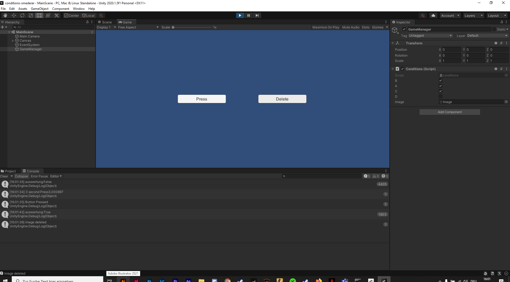

# Template2D-Unity202015f1

### Project description: 
conditions  

### Development platform: 
unity 1.5f1, visual studio 2019

### Target platform: 
-

### Visuals: 
-

### Necessary setup/execution steps: 
unity

### Third party material: 
-

### Project state: 

finished

### Limitations: 

### Lessons Learned: 
conditions, basics relearned (ve.if statements 

Copyright by smederer
